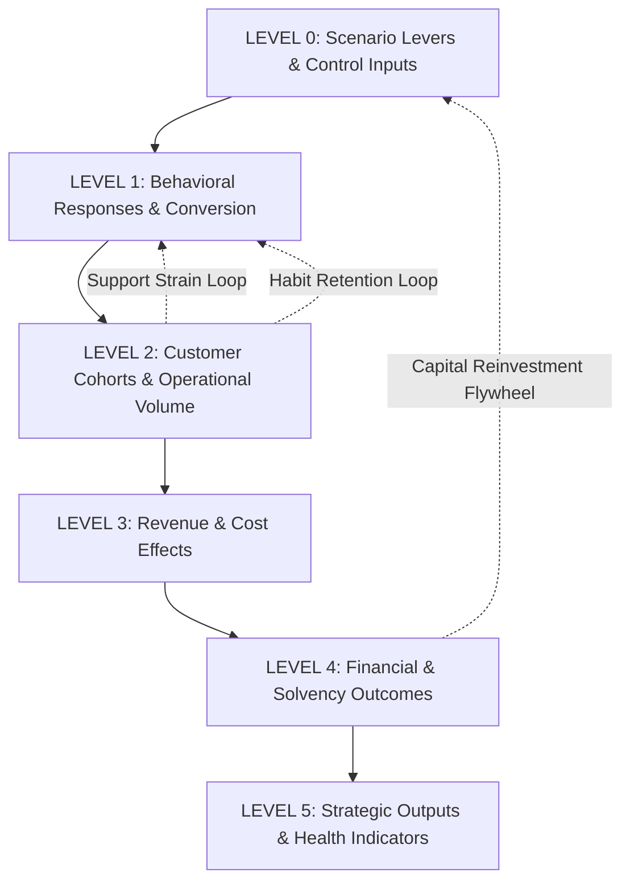
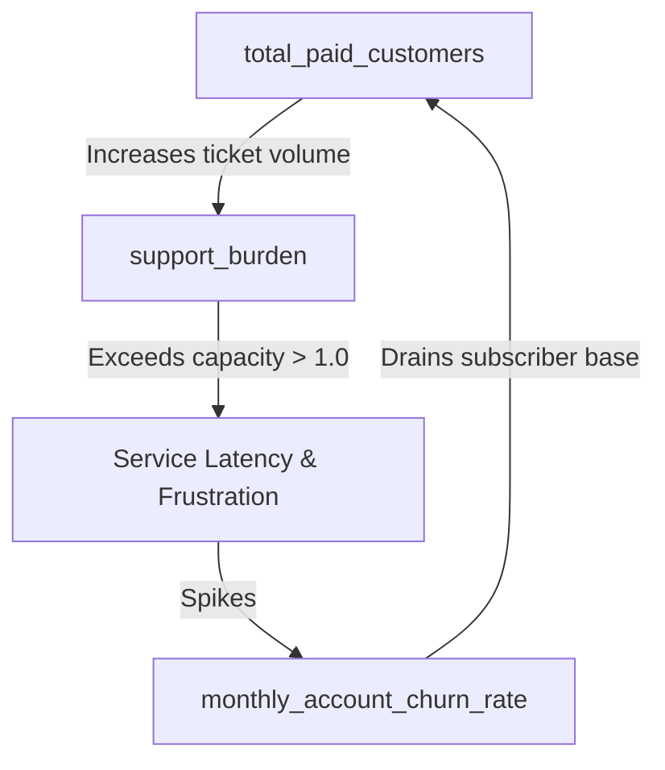
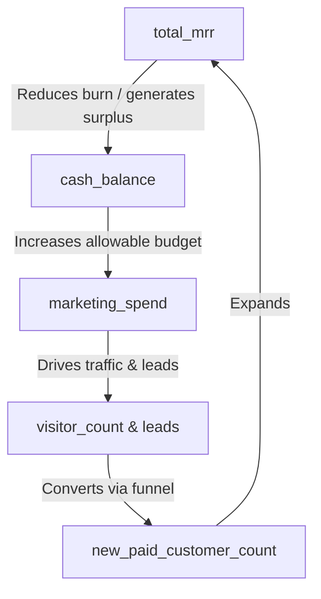
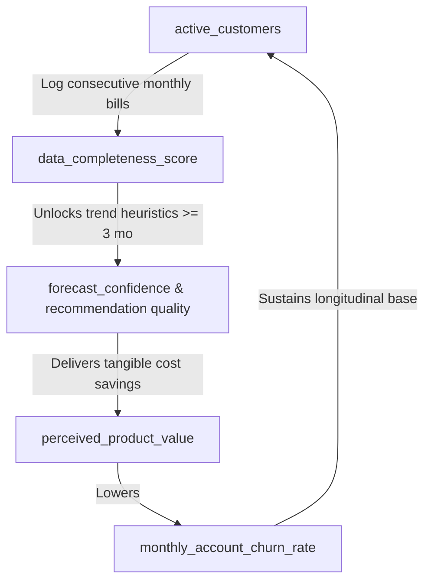

# WattWise Operating Simulator — Master Dependency Map
## Phase 2 Causal Architecture

This document formalizes the causal dependency graph, linkage typology, multi-level hierarchy, critical causal chains, and system feedback loops governing the WattWise Operating Simulator.

> [!IMPORTANT]
> **Phase 2 Governance Guardrail:**
> - This map defines causal relationships, directionality, evidence status, and feedback loops.
> - **Execution formulas, algorithms, regression weights, and code implementations are strictly prohibited in Phase 2** (reserved for Phase 3).
> - Mathematical relationships described herein serve solely as qualitative structural definitions.

---

## 1. System Dependency Levels

The simulator dependency architecture is organized into six functional levels:



- **LEVEL 0 — Scenario Levers & Control Inputs:** Packaging limits, prices, marketing budget, algorithmic modes, and initial cash reserves.
- **LEVEL 1 — Behavioral & Conversion Responses:** Conversion rates, signup friction, trial initiation, churn rates, and data quality scores.
- **LEVEL 2 — Customer Cohorts & Operational Volume:** Active subscriber states, trial users, managed locations, and generated support tickets.
- **LEVEL 3 — Revenue & Cost Effects:** Tier MRR, hosting, database storage, inference fees, support costs, and payment processing fees.
- **LEVEL 4 — Financial Outcomes:** Gross profit, gross margin rate, net burn, and remaining cash runway.
- **LEVEL 5 — Strategic Outputs & Health Indicators:** Overall venture sustainability, unit economic viability, and customer trust index.

---

## 2. Master Dependency Edge Registry

### Edge Taxonomy & Definitions
- **Direction:**
  - `POSITIVE` ($\uparrow \implies \uparrow$): Upstream increase drives downstream increase.
  - `NEGATIVE` ($\uparrow \implies \downarrow$): Upstream increase drives downstream decrease.
  - `CONDITIONAL`: Downstream reaction depends on a third control variable or threshold.
  - `NON_MONOTONIC`: Relationship changes slope (e.g. inverted-U or saturation curve).
  - `UNKNOWN`: Directionality not empirically validated.
- **Relationship Type:** `DIRECT`, `DERIVED`, `BEHAVIORAL`, `FINANCIAL`, `OPERATIONAL`, `DATA_QUALITY`, `CONTROL`, `ASSUMED`.
- **Evidence Status:** `VERIFIED_BEHAVIOR`, `MODEL_ASSUMPTION`, `BUSINESS_HYPOTHESIS`, `SIMULATION_RELATIONSHIP`, `UNKNOWN`.

### Edge Catalog Table

| # | Upstream Variable | Downstream Variable | Direction | Relationship Type | Evidence Status | Conf. | Notes |
| :- | :--- | :--- | :--- | :--- | :--- | :---: | :--- |
| **E-01** | `business_tier_location_cap` | `average_locations_per_business_account` | `POSITIVE` | `CONTROL` | `MODEL_ASSUMPTION` | `HIGH` | Higher cap allows multi-branch customers to manage more locations (ADR-002). |
| **E-02** | `average_locations_per_business_account` | `arpa_per_location` | `NEGATIVE` | `DERIVED` | `MODEL_ASSUMPTION` | `HIGH` | Under flat subscription price, more locations dilute revenue per location (C-003). |
| **E-03** | `average_locations_per_business_account` | `support_tickets_per_customer` | `POSITIVE` | `OPERATIONAL` | `BUSINESS_HYPOTHESIS` | `MEDIUM` | Managing multiple branches generates more onboarding and bill discrepancies. |
| **E-04** | `average_locations_per_business_account` | `database_cost` | `POSITIVE` | `OPERATIONAL` | `MODEL_ASSUMPTION` | `MEDIUM` | More locations multiply monthly billing records stored in `electricity_entries`. |
| **E-05** | `support_tickets_per_customer` | `support_burden` | `POSITIVE` | `OPERATIONAL` | `MODEL_ASSUMPTION` | `HIGH` | Higher per-customer inquiry rate increases overall ticket queue load. |
| **E-06** | `support_tickets_per_location` | `support_burden` | `POSITIVE` | `OPERATIONAL` | `BUSINESS_HYPOTHESIS` | `MEDIUM` | Multi-branch complexity generates incremental edge support tickets. |
| **E-07** | `support_capacity` | `support_burden` | `NEGATIVE` | `OPERATIONAL` | `MODEL_ASSUMPTION` | `HIGH` | Higher resolution capacity absorbs more ticket volume before queue degrades. |
| **E-08** | `total_paid_customers` | `support_burden` | `POSITIVE` | `OPERATIONAL` | `MODEL_ASSUMPTION` | `HIGH` | Larger customer base directly scales aggregate incoming inquiries. |
| **E-09** | `support_burden` | `monthly_account_churn_rate` | `CONDITIONAL` | `BEHAVIORAL` | `BUSINESS_HYPOTHESIS` | `MEDIUM` | When `support_burden > 1.0`, response latency increases, causing customer frustration and churn. |
| **E-10** | `support_burden` | `customer_support_cost` | `POSITIVE` | `FINANCIAL` | `MODEL_ASSUMPTION` | `HIGH` | Elevated support demand requires more paid support hours or external help. |
| **E-11** | `support_cost_per_ticket` | `monthly_support_cost` | `POSITIVE` | `FINANCIAL` | `MODEL_ASSUMPTION` | `HIGH` | Hourly labor rate directly scales the financial cost of resolving each inquiry. |
| **E-12** | `monthly_support_cost` | `customer_support_cost` | `POSITIVE` | `DIRECT` | `MODEL_ASSUMPTION` | `HIGH` | Maps operational support spend into venture direct Cost of Goods Sold. |
| **E-13** | `marketing_spend` | `visitor_count` | `POSITIVE` | `BEHAVIORAL` | `BUSINESS_HYPOTHESIS` | `MEDIUM` | Paid acquisition campaigns drive prospective visitors to the landing page. |
| **E-14** | `marketing_spend` | `leads` | `POSITIVE` | `BEHAVIORAL` | `BUSINESS_HYPOTHESIS` | `MEDIUM` | Outreach budget scales direct lead generation volume. |
| **E-15** | `marketing_spend` | `marketing_cost` | `POSITIVE` | `DIRECT` | `MODEL_ASSUMPTION` | `HIGH` | Discretionary spend directly constitutes sales and marketing operating expenses. |
| **E-16** | `marketing_spend` | `cac` | `POSITIVE` | `FINANCIAL` | `MODEL_ASSUMPTION` | `MEDIUM` | Higher acquisition spend raises customer acquisition cost if conversion stays flat. |
| **E-17** | `referral_rate` | `visitor_count` | `POSITIVE` | `BEHAVIORAL` | `BUSINESS_HYPOTHESIS` | `LOW` | Organic user word-of-mouth brings new visitors without paid ad spend. |
| **E-18** | `visitor_count` | `signup_count` | `POSITIVE` | `DERIVED` | `VERIFIED_BEHAVIOR` | `HIGH` | Top-of-funnel traffic volume scales absolute registered accounts. |
| **E-19** | `signup_rate` | `signup_count` | `POSITIVE` | `DERIVED` | `VERIFIED_BEHAVIOR` | `HIGH` | Registration throughput ratio directly determines created user accounts. |
| **E-20** | `free_plan_enabled` | `signup_rate` | `POSITIVE` | `BEHAVIORAL` | `BUSINESS_HYPOTHESIS` | `HIGH` | Free tier lowers barrier to entry, significantly increasing signup conversion. |
| **E-21** | `free_plan_enabled` | `active_free_customers` | `POSITIVE` | `CONTROL` | `VERIFIED_BEHAVIOR` | `HIGH` | Free tier policy gates entry into the non-paying active user state. |
| **E-22** | `signup_count` | `onboarded_user_count` | `POSITIVE` | `DERIVED` | `VERIFIED_BEHAVIOR` | `HIGH` | Registered accounts enter onboarding setup funnel. |
| **E-23** | `onboarding_completion_rate` | `onboarded_user_count` | `POSITIVE` | `DERIVED` | `VERIFIED_BEHAVIOR` | `HIGH` | Onboarding completion throughput dictates activated account cohort size. |
| **E-24** | `onboarded_user_count` | `trial_user_count` | `POSITIVE` | `DERIVED` | `VERIFIED_BEHAVIOR` | `HIGH` | Activated accounts provide the pool of candidates starting a Pro evaluation. |
| **E-25** | `onboarded_user_count` | `active_free_customers` | `POSITIVE` | `DERIVED` | `VERIFIED_BEHAVIOR` | `HIGH` | Onboarded users who do not start a trial or pay become Free tier users. |
| **E-26** | `trial_activation_trigger` | `trial_start_rate` | `CONDITIONAL` | `CONTROL` | `VERIFIED_BEHAVIOR` | `HIGH` | `AUTOMATIC` produces 100% trial start; `EXPLICIT` requires deliberate user click (ADR-003). |
| **E-27** | `trial_start_rate` | `trial_user_count` | `POSITIVE` | `DERIVED` | `MODEL_ASSUMPTION` | `HIGH` | Higher activation rate moves more onboarded cohorts into active trial evaluation. |
| **E-28** | `trial_duration_days` | `trial_user_count` | `POSITIVE` | `DERIVED` | `MODEL_ASSUMPTION` | `HIGH` | Longer trial duration keeps users in trial state longer before conversion gate. |
| **E-29** | `trial_user_count` | `new_paid_customer_count` | `POSITIVE` | `DERIVED` | `MODEL_ASSUMPTION` | `HIGH` | Mature trial cohorts reaching day 30 provide the denominator for paid conversion. |
| **E-30** | `trial_to_paid_conversion_rate` | `new_paid_customer_count` | `POSITIVE` | `DERIVED` | `MODEL_ASSUMPTION` | `HIGH` | Conversion rate directly dictates newly paying subscribers produced each month. |
| **E-31** | `trial_activation_trigger` | `trial_to_paid_conversion_rate` | `CONDITIONAL` | `BEHAVIORAL` | `BUSINESS_HYPOTHESIS` | `MEDIUM` | `EXPLICIT` trials have higher conversion intent; `AUTOMATIC` trials suffer lower intent (ADR-003). |
| **E-32** | `free_recommendation_gating_mode` | `trial_start_rate` | `CONDITIONAL` | `BEHAVIORAL` | `BUSINESS_HYPOTHESIS` | `LOW` | More aggressive blurring (`DATA_COMPLETENESS_ALERTS_ONLY`) increases trial upgrade pressure. |
| **E-33** | `free_history_retention_mode` | `active_free_customers` | `CONDITIONAL` | `BEHAVIORAL` | `MODEL_ASSUMPTION` | `MEDIUM` | `HARD_3_ENTRY_LIFETIME_CAP` halts retention at Month 4; `ROLLING_3_MONTH` sustains habit (ADR-005). |
| **E-34** | `free_history_retention_mode` | `data_completeness_score` | `POSITIVE` | `DATA_QUALITY` | `MODEL_ASSUMPTION` | `HIGH` | Rolling retention allows continuous logging beyond 3 months. |
| **E-35** | `leads` | `qualified_leads` | `POSITIVE` | `DERIVED` | `BUSINESS_HYPOTHESIS` | `MEDIUM` | Raw outreach volume filters into qualified target profile prospects. |
| **E-36** | `qualified_leads` | `new_paid_customer_count` | `POSITIVE` | `DERIVED` | `BUSINESS_HYPOTHESIS` | `MEDIUM` | Direct enterprise sales pipeline converts directly into paying Business accounts. |
| **E-37** | `sales_conversion_rate` | `new_paid_customer_count` | `POSITIVE` | `DERIVED` | `BUSINESS_HYPOTHESIS` | `MEDIUM` | Founder sales execution efficiency scales commercial conversion volume. |
| **E-38** | `new_paid_customer_count` | `cac` | `NEGATIVE` | `FINANCIAL` | `MODEL_ASSUMPTION` | `HIGH` | For a given marketing budget, converting more paying accounts reduces CAC. |
| **E-39** | `new_paid_customer_count` | `active_pro_customers` | `POSITIVE` | `STATE` | `MODEL_ASSUMPTION` | `HIGH` | Newly acquired self-serve customers increment active Pro subscriber base. |
| **E-40** | `new_paid_customer_count` | `active_business_customers` | `POSITIVE` | `STATE` | `MODEL_ASSUMPTION` | `HIGH` | Newly acquired commercial portfolio customers increment active Business subscriber base. |
| **E-41** | `pro_tier_location_cap` | `active_business_customers` | `NEGATIVE` | `BEHAVIORAL` | `BUSINESS_HYPOTHESIS` | `LOW` | If Pro offers 3 locations, small operators with 2–3 branches do not upgrade to Business (ADR-004). |
| **E-42** | `pro_tier_location_cap` | `active_pro_customers` | `POSITIVE` | `BEHAVIORAL` | `BUSINESS_HYPOTHESIS` | `LOW` | Permitting 3 locations increases Pro tier attractiveness for small commercial operators. |
| **E-43** | `monthly_account_churn_rate` | `churned_customer_count` | `POSITIVE` | `DERIVED` | `VERIFIED_BEHAVIOR` | `HIGH` | Churn percentage directly dictates lost customer count each month. |
| **E-44** | `monthly_account_churn_rate` | `retained_customer_count` | `NEGATIVE` | `DERIVED` | `VERIFIED_BEHAVIOR` | `HIGH` | Higher churn reduces surviving customer base renewing their subscription. |
| **E-45** | `total_paid_customers` | `churned_customer_count` | `POSITIVE` | `DERIVED` | `MODEL_ASSUMPTION` | `HIGH` | Larger subscriber base experiences higher absolute churn volume at fixed churn rate. |
| **E-46** | `total_paid_customers` | `retained_customer_count` | `POSITIVE` | `DERIVED` | `MODEL_ASSUMPTION` | `HIGH` | Base from which surviving renewals are drawn. |
| **E-47** | `active_pro_customers` | `total_paid_customers` | `POSITIVE` | `DERIVED` | `VERIFIED_BEHAVIOR` | `HIGH` | Pro subscribers sum into aggregate paid customer base. |
| **E-48** | `active_business_customers` | `total_paid_customers` | `POSITIVE` | `DERIVED` | `VERIFIED_BEHAVIOR` | `HIGH` | Business subscribers sum into aggregate paid customer base. |
| **E-49** | `active_pro_customers` | `pro_mrr` | `POSITIVE` | `FINANCIAL` | `VERIFIED_BEHAVIOR` | `HIGH` | Number of Pro subscribers multiplies by monthly fee to generate Pro MRR. |
| **E-50** | `pro_price_monthly` | `pro_mrr` | `POSITIVE` | `FINANCIAL` | `VERIFIED_BEHAVIOR` | `HIGH` | Higher price point increases MRR per subscriber. |
| **E-51** | `pro_price_monthly` | `trial_to_paid_conversion_rate` | `NEGATIVE` | `BEHAVIORAL` | `BUSINESS_HYPOTHESIS` | `MEDIUM` | Higher price elasticity reduces willingness to pay and conversion impulse. |
| **E-52** | `active_business_customers` | `business_mrr` | `POSITIVE` | `FINANCIAL` | `VERIFIED_BEHAVIOR` | `HIGH` | Number of Business accounts multiplies by monthly fee to generate Business MRR. |
| **E-53** | `business_price_monthly` | `business_mrr` | `POSITIVE` | `FINANCIAL` | `VERIFIED_BEHAVIOR` | `HIGH` | Business tier price point directly scales enterprise revenue. |
| **E-54** | `business_price_monthly` | `arpa_per_location` | `POSITIVE` | `FINANCIAL` | `MODEL_ASSUMPTION` | `HIGH` | Higher flat fee increases effective revenue earned per branch. |
| **E-55** | `pro_mrr` | `total_mrr` | `POSITIVE` | `FINANCIAL` | `VERIFIED_BEHAVIOR` | `HIGH` | Pro MRR sums into total venture monthly recurring revenue. |
| **E-56** | `business_mrr` | `total_mrr` | `POSITIVE` | `FINANCIAL` | `VERIFIED_BEHAVIOR` | `HIGH` | Business MRR sums into total venture monthly recurring revenue. |
| **E-57** | `total_mrr` | `arr` | `POSITIVE` | `FINANCIAL` | `VERIFIED_BEHAVIOR` | `HIGH` | Annualized run-rate revenue identity (`total_mrr * 12`). |
| **E-58** | `total_mrr` | `arpu` | `POSITIVE` | `FINANCIAL` | `MODEL_ASSUMPTION` | `HIGH` | Revenue numerator for average revenue per user calculation. |
| **E-59** | `active_free_customers` | `arpu` | `NEGATIVE` | `FINANCIAL` | `MODEL_ASSUMPTION` | `HIGH` | Unmonetized users dilute blended ARPU across registered user base. |
| **E-60** | `total_paid_customers` | `arpu` | `POSITIVE` | `FINANCIAL` | `MODEL_ASSUMPTION` | `HIGH` | Paying customer proportion increases blended ARPU. |
| **E-61** | `total_mrr` | `arpa` | `POSITIVE` | `FINANCIAL` | `VERIFIED_BEHAVIOR` | `HIGH` | Total revenue numerator for average revenue per paying account. |
| **E-62** | `total_paid_customers` | `arpa` | `NEGATIVE` | `FINANCIAL` | `MODEL_ASSUMPTION` | `HIGH` | Dilutes ARPA toward Rp49.000 if Pro customer share expands faster than Business. |
| **E-63** | `data_provenance_mode` | `recorded_meter_data_ratio` | `CONDITIONAL` | `DATA_QUALITY` | `MODEL_ASSUMPTION` | `HIGH` | `STRICT_TAGGED` requires verified meter tagging; `UNTAGGED` treats estimates uniformly (ADR-007). |
| **E-64** | `data_provenance_mode` | `estimated_value_ratio` | `CONDITIONAL` | `DATA_QUALITY` | `MODEL_ASSUMPTION` | `HIGH` | Isolates and penalizes synthetic estimations when strict tagging is active. |
| **E-65** | `recorded_meter_data_ratio` | `data_quality_score` | `POSITIVE` | `DATA_QUALITY` | `MODEL_ASSUMPTION` | `HIGH` | Physical meter readings provide ground truth, improving composite data health. |
| **E-66** | `estimated_value_ratio` | `data_quality_score` | `NEGATIVE` | `DATA_QUALITY` | `MODEL_ASSUMPTION` | `HIGH` | Algorithmic estimations lack billing tariff nuances, degrading data health. |
| **E-67** | `estimated_value_ratio` | `forecast_error_rate` | `POSITIVE` | `DATA_QUALITY` | `BUSINESS_HYPOTHESIS` | `MEDIUM` | Using estimated bills to forecast next month propagates compounding synthetic error. |
| **E-68** | `data_completeness_score` | `data_quality_score` | `POSITIVE` | `DATA_QUALITY` | `MODEL_ASSUMPTION` | `HIGH` | Consecutive monthly records eliminate data gaps and missing history penalties. |
| **E-69** | `data_completeness_score` | `forecast_confidence` | `POSITIVE` | `DATA_QUALITY` | `VERIFIED_BEHAVIOR` | `HIGH` | $\ge 3$ months enables trend slope heuristic; <3 months disables trend confidence (T-06). |
| **E-70** | `data_quality_score` | `forecast_confidence` | `POSITIVE` | `DATA_QUALITY` | `MODEL_ASSUMPTION` | `HIGH` | Clean, verified meter history increases algorithmic projection certainty. |
| **E-71** | `data_quality_score` | `trial_to_paid_conversion_rate` | `POSITIVE` | `BEHAVIORAL` | `BUSINESS_HYPOTHESIS` | `MEDIUM` | Accurate data generates believable recommendations, increasing user conversion. |
| **E-72** | `data_quality_score` | `monthly_account_churn_rate` | `NEGATIVE` | `BEHAVIORAL` | `BUSINESS_HYPOTHESIS` | `MEDIUM` | High data accuracy prevents bogus utility alerts, sustaining user retention. |
| **E-73** | `data_quality_score` | `referral_rate` | `POSITIVE` | `BEHAVIORAL` | `BUSINESS_HYPOTHESIS` | `LOW` | Reliable utility insights encourage business owners to recommend WattWise. |
| **E-74** | `forecast_method` | `forecast_compute_cost` | `CONDITIONAL` | `CONTROL` | `VERIFIED_BEHAVIOR` | `HIGH` | `DETERMINISTIC_HEURISTIC` = Rp0; cloud ML models introduce per-query compute fees (ADR-006). |
| **E-75** | `forecast_method` | `inference_cost` | `CONDITIONAL` | `FINANCIAL` | `VERIFIED_BEHAVIOR` | `HIGH` | Heuristic runs in PHP (Rp0); cloud ML scales monthly GPU bill with user volume. |
| **E-76** | `forecast_method` | `forecast_error_rate` | `CONDITIONAL` | `OPERATIONAL` | `SIMULATION_RELATIONSHIP` | `LOW` | ML models hypothesized to reduce MAPE on non-linear commercial loads (unverified). |
| **E-77** | `forecast_method` | `forecast_confidence` | `CONDITIONAL` | `OPERATIONAL` | `MODEL_ASSUMPTION` | `MEDIUM` | Algorithmic sophistication changes confidence interval modeling bounds. |
| **E-78** | `forecast_compute_cost` | `inference_cost` | `POSITIVE` | `FINANCIAL` | `MODEL_ASSUMPTION` | `HIGH` | Multiplies by active forecasts to yield total monthly inference cloud expense. |
| **E-79** | `forecast_error_rate` | `forecast_confidence` | `NEGATIVE` | `DATA_QUALITY` | `MODEL_ASSUMPTION` | `HIGH` | Higher historical projection errors directly degrade reported confidence band. |
| **E-80** | `forecast_confidence` | `trial_to_paid_conversion_rate` | `POSITIVE` | `BEHAVIORAL` | `BUSINESS_HYPOTHESIS` | `MEDIUM` | High prediction credibility reinforces product value, lifting trial conversion. |
| **E-81** | `forecast_confidence` | `monthly_account_churn_rate` | `NEGATIVE` | `BEHAVIORAL` | `BUSINESS_HYPOTHESIS` | `MEDIUM` | Reliable utility forecasting provides ongoing decision value, curbing churn. |
| **E-82** | `forecast_confidence` | `referral_rate` | `POSITIVE` | `BEHAVIORAL` | `BUSINESS_HYPOTHESIS` | `LOW` | High predictive trust leads to enthusiastic commercial peer referrals. |
| **E-83** | `hosting_cost` | `monthly_operating_cost` | `POSITIVE` | `FINANCIAL` | `VERIFIED_BEHAVIOR` | `HIGH` | Base server infrastructure constitutes fixed monthly operating overhead. |
| **E-84** | `database_cost` | `monthly_operating_cost` | `POSITIVE` | `FINANCIAL` | `MODEL_ASSUMPTION` | `HIGH` | Database instance scaling increments monthly operating expenses. |
| **E-85** | `database_cost` | `gross_profit` | `NEGATIVE` | `FINANCIAL` | `MODEL_ASSUMPTION` | `HIGH` | Direct variable cloud data cost is deducted as service COGS. |
| **E-86** | `inference_cost` | `monthly_operating_cost` | `POSITIVE` | `FINANCIAL` | `MODEL_ASSUMPTION` | `HIGH` | Cloud AI API fees increment monthly operating expenses. |
| **E-87** | `inference_cost` | `gross_profit` | `NEGATIVE` | `FINANCIAL` | `MODEL_ASSUMPTION` | `HIGH` | Direct model inference cost is deducted as service COGS. |
| **E-88** | `total_paid_customers` | `payment_gateway_cost` | `POSITIVE` | `FINANCIAL` | `MODEL_ASSUMPTION` | `HIGH` | Fixed fee per payment transaction scales with paying subscriber count. |
| **E-89** | `total_mrr` | `payment_gateway_cost` | `POSITIVE` | `FINANCIAL` | `MODEL_ASSUMPTION` | `HIGH` | Percentage processing fee scales directly with billed revenue volume. |
| **E-90** | `payment_gateway_cost` | `monthly_operating_cost` | `POSITIVE` | `FINANCIAL` | `MODEL_ASSUMPTION` | `HIGH` | Transaction fees increment monthly operating expenses. |
| **E-91** | `payment_gateway_cost` | `gross_profit` | `NEGATIVE` | `FINANCIAL` | `MODEL_ASSUMPTION` | `HIGH` | Merchant processing fees are deducted directly from top-line revenue as COGS. |
| **E-92** | `customer_support_cost` | `monthly_operating_cost` | `POSITIVE` | `FINANCIAL` | `MODEL_ASSUMPTION` | `HIGH` | Labor cost of managing customer inquiries sums into monthly operating spend. |
| **E-93** | `customer_support_cost` | `gross_profit` | `NEGATIVE` | `FINANCIAL` | `MODEL_ASSUMPTION` | `HIGH` | Direct customer onboarding and support labor is treated as service delivery COGS. |
| **E-94** | `marketing_cost` | `monthly_operating_cost` | `POSITIVE` | `FINANCIAL` | `MODEL_ASSUMPTION` | `HIGH` | Sales and marketing expenditure adds directly to monthly OpEx. |
| **E-95** | `total_mrr` | `gross_profit` | `POSITIVE` | `FINANCIAL` | `VERIFIED_BEHAVIOR` | `HIGH` | Top-line recurring revenue is the base from which COGS is deducted. |
| **E-96** | `gross_profit` | `gross_margin_rate` | `POSITIVE` | `FINANCIAL` | `VERIFIED_BEHAVIOR` | `HIGH` | Numerator of the gross margin percentage calculation. |
| **E-97** | `total_mrr` | `gross_margin_rate` | `NON_MONOTONIC` | `FINANCIAL` | `MODEL_ASSUMPTION` | `HIGH` | Denominator of margin rate; margin expands if fixed costs dilute, but compresses if COGS scales faster. |
| **E-98** | `monthly_operating_cost` | `monthly_burn` | `POSITIVE` | `FINANCIAL` | `VERIFIED_BEHAVIOR` | `HIGH` | Higher expenses directly increase net monthly cash deficit. |
| **E-99** | `total_mrr` | `monthly_burn` | `NEGATIVE` | `FINANCIAL` | `VERIFIED_BEHAVIOR` | `HIGH` | Subscription revenue directly offsets operational expenses, reducing net burn. |
| **E-100** | `monthly_burn` | `cash_balance` | `NEGATIVE` | `FINANCIAL` | `VERIFIED_BEHAVIOR` | `HIGH` | Monthly cash deficit subtracts directly from venture bank reserves each cycle. |
| **E-101** | `monthly_burn` | `cash_runway_months` | `NEGATIVE` | `FINANCIAL` | `VERIFIED_BEHAVIOR` | `HIGH` | Faster cash drain rate shortens remaining operational runway duration. |
| **E-102** | `cash_balance` | `cash_runway_months` | `POSITIVE` | `FINANCIAL` | `VERIFIED_BEHAVIOR` | `HIGH` | Higher liquid cash reserves extend operational runway duration. |
| **E-103** | `cash_balance` | `marketing_spend` | `CONDITIONAL` | `FINANCIAL` | `BUSINESS_HYPOTHESIS` | `MEDIUM` | Solvency constraint: marketing budget must be capped when cash reserves drop below safety threshold. |

---

## 3. Critical Causal Chains

The following five causal chains represent the most critical operational, financial, and product dynamics modeled by the simulator:

### Chain 1: Multi-Location Support Overload Chain
Traces the systemic risk of generous branch location entitlements on Business tier:
```text
business_tier_location_cap (e.g. 50 locations per ADR-002)
  │
  ▼ (POSITIVE)
average_locations_per_business_account (increases toward 8–25 branches)
  │
  ├─────────────────────────────────────────────────┐
  ▼ (NEGATIVE)                                      ▼ (POSITIVE)
arpa_per_location (dilutes to Rp2.980/branch)    support_tickets_per_customer (escalates)
                                                    │
                                                    ▼ (POSITIVE)
                                                 support_burden (exceeds 1.0 capacity)
                                                    │
                                                    ├───────────────────────────────┐
                                                    ▼ (POSITIVE)                    ▼ (POSITIVE)
                                                 customer_support_cost (spikes)   monthly_account_churn_rate
                                                    │                               │
                                                    ▼ (NEGATIVE)                    ▼ (NEGATIVE)
                                                 gross_margin_rate (collapses)    retained_customer_count
```

### Chain 2: Onboarding-to-Conversion Revenue Chain
Traces the self-serve funnel throughput from acquisition to paid recurring revenue:
```text
marketing_spend (Rp2.000.000)
  │
  ▼ (POSITIVE)
visitor_count (1.000 visitors)
  │
  ▼ (POSITIVE via signup_rate: 0.05)
signup_count (50 signups)
  │
  ▼ (POSITIVE via onboarding_completion_rate: 0.60)
onboarded_user_count (30 activated users)
  │
  ▼ (CONDITIONAL via trial_activation_trigger: EXPLICIT vs AUTOMATIC)
trial_user_count (e.g. 8–30 users in 30-day evaluation)
  │
  ▼ (POSITIVE via trial_to_paid_conversion_rate: 0.03)
new_paid_customer_count (1–3 new paying subscribers)
  │
  ▼ (POSITIVE via pro_price_monthly / business_price_monthly)
total_mrr (expands by Rp49.000–Rp149.000 per converted account)
```

### Chain 3: Churn Decay & Net MRR Contraction Chain
Models the compounding drag of monthly customer churn on venture growth:
```text
monthly_account_churn_rate (e.g. stress-test 15% vs baseline 5%)
  │
  ▼ (POSITIVE)
churned_customer_count (erodes subscriber base)
  │
  ▼ (NEGATIVE)
retained_customer_count (collapses customer lifetime from 20 to 6.7 months)
  │
  ▼ (NEGATIVE)
total_mrr (shrinks recurring cash flow)
  │
  ▼ (POSITIVE)
monthly_burn (widens operating deficit)
  │
  ▼ (NEGATIVE)
cash_runway_months (depletes bank reserves prematurely)
```

### Chain 4: Data Ingestion Quality to Forecast Trust Chain
Traces the impact of strict provenance tagging on user retention and viral growth:
```text
data_provenance_mode (STRICT_TAGGED per ADR-007)
  │
  ▼ (POSITIVE)
recorded_meter_data_ratio (enforces physical meter baseline)
  │
  ▼ (NEGATIVE)
estimated_value_ratio (penalizes synthetic data pollution)
  │
  ▼ (POSITIVE)
data_quality_score (approaches 0.90+)
  │
  ▼ (POSITIVE via data_completeness_score >= 3 months)
forecast_confidence (high prediction certainty displayed in UI)
  │
  ├──────────────────────────────────┬──────────────────────────────────┐
  ▼ (POSITIVE)                       ▼ (NEGATIVE)                       ▼ (POSITIVE)
trial_to_paid_conversion_rate     monthly_account_churn_rate         referral_rate
(user perceives utility)           (prevented bogus alerts)          (peer recommendations)
```

### Chain 5: Pro Tier Packaging Cannibalization Chain
Evaluates whether permitting 3 locations on Pro cannibalizes Business tier upgrades:
```text
pro_tier_location_cap (3 locations per ADR-004)
  │
  ├─────────────────────────────────────────────────┐
  ▼ (POSITIVE)                                      ▼ (NEGATIVE)
active_pro_customers (appeals to 2–3 branch SMEs)  active_business_customers (upgrade delay)
  │                                                 │
  ▼ (POSITIVE @ Rp49.000/mo)                        ▼ (NEGATIVE @ Rp149.000/mo)
pro_mrr (steady baseline)                         business_mrr (constrained growth)
  │                                                 │
  └────────────────────────┬────────────────────────┘
                           ▼
                       blended_arpa (stabilizes near ~Rp65.000 instead of ~Rp120.000)
```

---

## 4. System Feedback Loops

The simulator contains three closed-loop feedback dynamics that create non-linear behavior over multi-month horizons. In accordance with strict governance, all three loops are classified as **`STRUCTURAL MODEL HYPOTHESIS`** (unverified empirically in live production; requiring empirical validation as commercial telemetry matures):

### Feedback Loop 1: Support Capacity Strain & Churn Spiral (Balancing / Destabilizing)
- **Classification:** `STRUCTURAL MODEL HYPOTHESIS`
- **Empirical Status:** `EMPIRICAL_VALIDATION_REQUIRED = YES` (Zero empirical customer support ticketing and retention logs in current snapshot).
- **Mechanism:** Rapid subscriber acquisition scales support inquiries beyond existing team capacity. High support latency reduces product satisfaction, sparking customer churn that throttles growth.

- **Loop Type:** Balancing / Destabilizing Reinforcement.
- **Simulator Treatment:** If `support_burden > 1.0`, an illustrative non-linear penalty multiplier is applied to `monthly_account_churn_rate` until capacity is expanded or growth slows.

### Feedback Loop 2: Cash Reinvestment & Acquisition Flywheel (Reinforcing)
- **Classification:** `STRUCTURAL MODEL HYPOTHESIS`
- **Empirical Status:** `EMPIRICAL_VALIDATION_REQUIRED = YES` (Discretionary founder policy hypothesis; no live automated reinvestment rule exists).
- **Mechanism:** Growing MRR generates operating cash flow, expanding available marketing budget. Higher ad spend attracts larger visitor cohorts, producing more paying customers and further increasing MRR.

- **Loop Type:** Reinforcing Growth Loop.
- **Simulator Treatment:** `marketing_spend` is conditionally linked to cash reserve thresholds, modeling venture capital efficiency and growth acceleration scenarios.

### Feedback Loop 3: Data Completeness & Longitudinal Habit Retention (Reinforcing)
- **Classification:** `STRUCTURAL MODEL HYPOTHESIS`
- **Empirical Status:** `EMPIRICAL_VALIDATION_REQUIRED = YES` (Longitudinal behavioral retention hypothesis; unverified in commercial pilots).
- **Mechanism:** Consecutive monthly data entries unlock longitudinal trend forecasting and accurate inspection recommendations. Higher predictive confidence increases perceived value, motivating users to continue logging monthly utility bills.

- **Loop Type:** Reinforcing Retention Loop.
- **Simulator Treatment:** Free tier retention beyond Month 3 depends on `data_completeness_score` and `forecast_confidence`, simulating the formation of recurring management habits.
