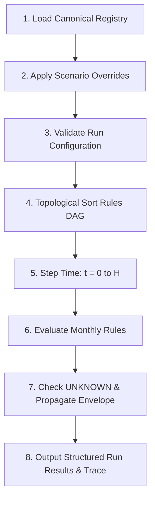

# WattWise Operating Simulator — Phase 3 Engine Architecture

This document defines the computational architecture, execution pipeline, state representation, and epistemic boundaries for the **Phase 3 Core Simulation Engine** of the WattWise Operating Simulator.

---

## 1. System Mission & Core Principles

The Phase 3 Core Simulation Engine translates the Phase 2 Variable Dictionary, Dependency Map, and Numeric Provenance Model into an executable, deterministic computational kernel.

### The 7 Inviolable Engine Principles

1. **Strict Determinism:** Identical inputs + identical scenario overrides + identical model version MUST yield bit-for-bit identical simulation results. No stochastic randomness, seed variance, or Monte Carlo sampling is permitted in Phase 3.
2. **First-Class UNKNOWN Handling:** Missing empirical data is a valid epistemic state (`UNKNOWN`). The engine must NEVER coerce `UNKNOWN` to `0`, `false`, empty string, or arbitrary magic defaults. If a mandatory input is unknown, derived outputs must safely propagate as `UNKNOWN` with an explicit reason.
3. **Traceability & Explainability:** Every calculated value is wrapped in an envelope containing value, units, knowledge status, confidence rating, provenance, and a step-by-step causal explanation.
4. **Config-Driven & Zero Magic Numbers:** All material coefficients, baselines, and boundaries reside in centralized registries. No hardcoded magic numeric literals may influence calculation results.
5. **Baseline Immutability:** Running a scenario must never mutate the canonical baseline state or affect subsequent simulation runs.
6. **Framework Independence:** The engine is built using plain JavaScript ES Modules (`node:test` / `node:assert`). It has zero runtime dependencies, zero coupling to UI frameworks (React/Vue/Next.js), and is executable in both Node.js and browser environments.
7. **Strict Separation of Entity Economics:** The customer-facing business metric `revenue_after_electricity` (ADR-008) measures client business unit contribution and is strictly decoupled from WattWise startup revenue (MRR/ARR/Gross Profit).

---

## 2. Value Envelope & Provenance Model

Values inside the engine are never passed as bare primitives. They are encapsulated in a **SimulationValue Envelope**:

```javascript
class SimulationValue {
  constructor({
    value,
    variable_id,
    unit = '',
    knowledge_status = 'CURRENT',
    confidence = 'HIGH',
    provenance = 'CANONICAL_BASELINE',
    explanation = '',
    is_unknown = false
  }) {
    this.value = is_unknown ? 'UNKNOWN' : value;
    this.variable_id = variable_id;
    this.unit = unit;
    this.knowledge_status = knowledge_status;
    this.confidence = confidence;
    this.provenance = provenance;
    this.explanation = explanation;
    this.is_unknown = is_unknown || value === 'UNKNOWN';
  }
}
```

### Knowledge Status Propagation Rules

When an output is derived from multiple inputs:
- If ANY mandatory input is `UNKNOWN`, the output becomes `UNKNOWN` (status: `UNKNOWN`, confidence: `UNKNOWN`).
- If ANY input has status `HYPOTHESIS`, the output status is at most `HYPOTHESIS`.
- If ANY input has status `SIMULATION_ASSUMPTION` (and none are HYPOTHESIS), the output is `SIMULATION_ASSUMPTION`.
- If ALL inputs are `CURRENT` or `ACCEPTED_BASELINE`, the output inherits `ACCEPTED_BASELINE` or `VERIFIED_BEHAVIOR`.

---

## 3. Simulation State & Time Model

### Discrete-Time Monthly Ticks

- The simulation clock operates on discrete monthly intervals:
  $$\Delta t = 1 \text{ month}$$
- State at time $t$ is denoted as $S_t$, where $t \in \{0, 1, 2, \dots, H\}$ and $H = \text{simulation\_horizon\_months}$ (baseline = 12).
- **$t = 0$ (Initial State):** Represents initial capitalization (`cash_balance`), initial customer base, and baseline configuration.
- **$t \ge 1$ (Simulation Steps):** Evaluates cohort aging, customer growth funnels, recurring billing, operational ticket loads, infrastructure expenses, and solvency reserves.

### Intra-Tick vs. Inter-Tick Dynamics

1. **Intra-Tick (DAG Resolution):** Within a single month $t$, all rules form a Directed Acyclic Graph (DAG). Dependencies are resolved in topological order. Any cyclic dependency within a single tick is detected as a fatal `CycleError`.
2. **Inter-Tick (Feedback Loops):** System dynamics feedback loops (such as the Support Strain Spiral or Cash Reinvestment Flywheel) operate across time boundaries:
   $$\text{Churn Multiplier}_{t} = f(\text{Support Burden}_{t-1})$$
   $$\text{Allowable Marketing Budget}_{t} = f(\text{Cash Balance}_{t-1}, \text{MRR}_{t-1})$$
   This architectural boundary completely eliminates algebraic recursion while accurately modeling lagged causal effects.

---

## 4. Scenario Management & Override Rules

A **Scenario** is a structured set of parameter overrides applied against the canonical baseline:

```javascript
class Scenario {
  constructor({
    id,
    name,
    description = '',
    overrides = {},
    metadata = {}
  }) {
    this.id = id;
    this.name = name;
    this.description = description;
    this.overrides = Object.freeze({ ...overrides });
    this.metadata = metadata;
  }
}
```

### Override Verification Guardrails

Before execution, the `ScenarioValidator` enforces:
1. **Variable Existence:** Override key must match an existing registered `Variable ID`.
2. **Data Type Integrity:** Value type must strictly match the variable's declared type (`boolean`, `integer`, `float`, `enum`).
3. **Boundary Adherence:**
   - Numerical values must satisfy declared `[minimum, maximum]` ranges.
   - Enums must belong to the declared enum options set.
   - Rate/probability variables must satisfy $0.0 \le \text{rate} \le 1.0$.
4. **Baseline Immutability:** Overrides are merged into an isolated run-context copy. The canonical baseline registry is frozen (`Object.freeze`) and remains immutable.

---

## 5. Dependency Resolution Pipeline

The engine executes in four distinct phases:



### Dependency Resolver Algorithm

1. Inspect all registered executable rules.
2. Build adjacency list of variables: $V_{\text{out}} \leftarrow \{ V_{\text{in}, 1}, V_{\text{in}, 2}, \dots \}$.
3. Perform depth-first search (DFS) with cycle detection (`UNVISITED`, `VISITING`, `VISITED`).
4. Generate topological execution order for intra-tick evaluation.
5. If a direct cycle is detected, halt with a detailed `CycleError` identifying the cyclic path.

---

## 6. Error & Validation Hierarchy

The engine utilizes specific error classes to ensure debuggability:

- **`ValidationError`:** Raised when scenario overrides violate type, enum, or range constraints.
- **`CycleError`:** Raised when an intra-tick circular dependency is detected in registered rules.
- **`UnknownVariableError`:** Raised when referencing an unregistered variable ID.
- **`ModelExecutionError`:** Raised when a calculation rule encounters a fatal mathematical anomaly (e.g. invalid arithmetic state).

---

## 7. Fractional Expected-Value Representation

- In accordance with Phase 3 specifications, customer acquisition and cohort decay calculations use **deterministic expected-value mathematics**.
- Customer counts may be fractional floats during internal state progression (e.g. $100 \text{ visitors} \times 0.035 \text{ conversion} = 3.5 \text{ customers}$).
- Fractional values prevent artificial threshold discontinuities and preserve exact determinism without stochastic rounding noise.
- Presentation layers in Phase 4 may format values as rounded integers for display.

---

## 8. Approved Baselines, ADR Locks & Epistemic Taxonomy

### Canonical ADR-Locked Baselines (Human-Accepted Policies)
The phrase **"Locked Human ADR Baselines"** applies strictly to values established by accepted Architecture Decision Records:
- `business_tier_location_cap = 50` (ADR-002)
- `trial_activation_trigger = EXPLICIT` (ADR-003)
- `pro_tier_location_cap = 3` (ADR-004)
- `free_history_retention_mode = ROLLING_3_MONTH_WINDOW` (ADR-005)
- `forecast_method = DETERMINISTIC_HEURISTIC` (ADR-006)
- `data_provenance_mode = STRICT_TAGGED` (ADR-007)
- `revenue_after_electricity = canonical customer metric` (ADR-008)

### Source-Backed Current / Model Baselines (Non-ADR)
The following model parameters carry empirical/code authority from repository artifacts but are **NOT ADR-locked**:
- `pro_price_monthly = 49000` (Knowledge Status: `CURRENT` [UI Display SRC-015] / `HYPOTHESIS` [WTP])
- `business_price_monthly = 149000` (Knowledge Status: `CURRENT` [UI Display SRC-015] / `HYPOTHESIS` [WTP])
- `trial_duration_days = 30` (Knowledge Status: `CURRENT & ACCEPTED_BASELINE` [SRC-012, T-02])
- `free_plan_enabled = true` (Knowledge Status: `CURRENT` [SRC-010, T-04])

### Flexible Simulation Variables (Non-ADR)
- `free_recommendation_gating_mode`: Baseline = `TOP_3_ANY_CATEGORY`; Scenario Alternative = `DATA_COMPLETENESS_ALERTS_ONLY`. Retains multi-scenario flexibility and is not locked by ADR.

### The 10 Canonical Empirical Unknowns (Default = UNKNOWN)
A **Canonical Empirical Unknown** is a real-world parameter that lacks empirical WattWise operational evidence and was formally cataloged during Phase 2 (`Variable_Dictionary.md` §4). Exactly 10 variables constitute this canonical register:
1. `monthly_account_churn_rate`
2. `trial_to_paid_conversion_rate`
3. `cac`
4. `support_tickets_per_customer`
5. `support_cost_per_ticket`
6. `support_tickets_per_location`
7. `visitor_count`
8. `forecast_error_rate`
9. `database_cost`
10. `average_locations_per_business_account`

### Derived Runtime UNKNOWN vs Canonical Empirical UNKNOWN
- **Runtime UNKNOWN:** Any variable that evaluates to `UNKNOWN` during a simulation run because one or more required upstream inputs are unknown (e.g. `signup_count`, `onboarded_user_count`, `trial_user_count`, `new_paid_customer_count`, `total_mrr`, `arr`, `monthly_burn`, `cash_runway_months`). A derived variable becoming `UNKNOWN` at runtime does **NOT** make it a member of the canonical empirical unknown register.
- **Unseeded Simulation Inputs:** Levers such as `signup_rate`, `onboarding_completion_rate`, `trial_start_rate`, `leads`, and `qualified_leads` default to `UNKNOWN` in baseline but represent scenario inputs without defaults, not canonical empirical unknowns.
- **Inter-Tick Unknown Safety:** Cash carryover (`cash_balance`) and customer cohort carryover (`active_pro_customers`, `active_business_customers`) explicitly propagate `UNKNOWN` when upstream inputs (`monthly_burn`, `cash_balance`, or `retained_customer_count`) are `UNKNOWN`. No transition may silently coerce `UNKNOWN` to `0` or arbitrary defaults.

